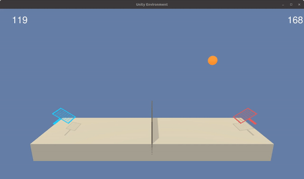

# Tennis Agent


## The Environment
In this environment, two agents control rackets to bounce a ball over a net. If an agent hits the ball over the net, it receives a reward of +0.1. If an agent lets a ball hit the ground or hits the ball out of bounds, it receives a reward of -0.01. Thus, the goal of each agent is to keep the ball in play.

The observation space consists of 8 variables corresponding to the position and velocity of the ball and racket. Each agent receives its own, local observation. Two continuous actions are available, corresponding to movement toward (or away from) the net, and jumping.

The task is episodic, and in order to solve the environment, the agents must get an average score of +0.5 (over 100 consecutive episodes, after taking the maximum over both agents). Specifically,

+ After each episode, we add up the rewards that each agent received (without discounting), to get a score for each agent. This yields 2 (potentially different) scores. We then take the maximum of these 2 scores.
+ This yields a single score for each episode.

The environment is considered solved, when the average (over 100 episodes) of those scores is at least +0.5.

## Getting Started
To set up your python environment to run the code in this repository, follow the instructions below.

1. Create (and activate) a new environment with Python 3.6.

	- __Linux__ or __Mac__: 
	```bash
	conda create --name drlnd python=3.6
	source activate drlnd
	```
	- __Windows__: 
	```bash
	conda create --name drlnd python=3.6 
	activate drlnd
	```
	
2. Clone the repository (if you haven't already!), and navigate to the `python/` folder.  Then, install several dependencies.
```bash
git clone https://github.com/moritztng/reacher-agent.git
cd reacher-agent/python
pip install .
```

3. Download the Unity Environment
Download the Unity Environment from one of the links below. You need only select the environment that matches your operating system:
- Linux: [Linux](https://s3-us-west-1.amazonaws.com/udacity-drlnd/P3/Tennis/Tennis_Linux.zip)
- Mac OSX: [Mac](https://s3-us-west-1.amazonaws.com/udacity-drlnd/P3/Tennis/Tennis.app.zip)
- Windows(32 Bit):[W32](https://s3-us-west-1.amazonaws.com/udacity-drlnd/P3/Tennis/Tennis_Windows_x86.zip)
- Windows(64 Bit): [W64](https://s3-us-west-1.amazonaws.com/udacity-drlnd/P3/Tennis/Tennis_Windows_x86_64.zip)

Then, place the file in the GitHub repository, and unzip (or decompress) the file.

4. Create an IPython kernel for the `drlnd` environment.
```
python -m ipykernel install --user --name drlnd --display-name "drlnd"
```

5. Before running code in a notebook, change the kernel to match the `drlnd` environment by using the drop-down `Kernel` menu.

## Training
I framed this problem as a Markov Decision Process. Therefore it makes sense to tackle the problem with reinforcement learning. However, in this environment we have a **continuous action space**. Hence, we can't make use of traditional value based methods like **(Deep-)Q-Learning**. That means we have to use some kind of policy based method. However, in most problems value based methods perform way better than policy based methods. Thus, we choose something in between and make use of an **actor critic method**, namely **DDPG**. Further we are dealing with a multi agent problem. However each agent can observe the whole state space and we only have two agents. Hence, we can apply single agent ddpg to solve the environment. Think of it as one agent controlling both rackets. For more information take a look at the [Notebook](train.ipynb) or the [report](report.md). 

You have to options to train the agent. 

1. Run the [Notebook](train_ddpg.ipynb). (Make sure to choose the `drlnd` Kernel) 
2. Run `visdom` and then `train_ddpg.py`. (Use `python train_ddpg.py -h` to see all options)

The benefit of the second option is, that you can watch the live training metrics.

## Testing
Take a look at the `Evaluation` and `Watch the Agent` section in the [Notebook](train.ipynb) to test and watch the agent play. 

## Acknowledgement
This project was part of the Udacity Reinforcement Learning Nanodegree. Without their resources the project would not exist.
