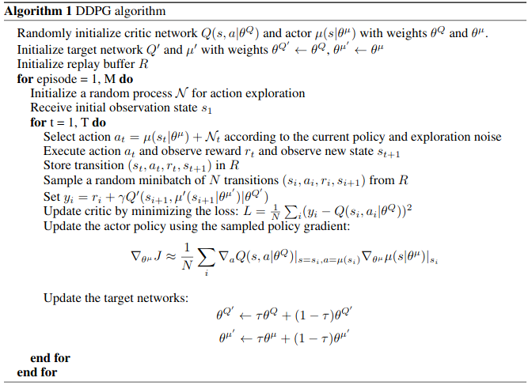
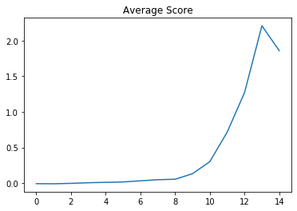
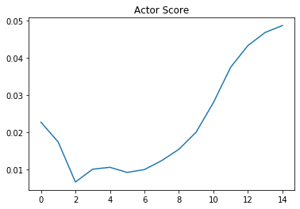
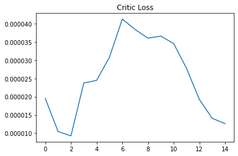

# Implementation Details
In general the code is an implementation of the [DDPG Paper](https://arxiv.org/pdf/1509.02971.pdf), but I made some minor adjustments to make it work in the reacher environment.
Take a look at **Section 3: Algorithm** and **Section 7: Experiment Details**.

## The Basic DDPG Algorithm

## Network Architecture
I tried batch normalization as stated in the paper, but I could not benefit from it. In fact it made the training performance even worse.
Hence I decided, to not use it.
The rest of the network architecture is identical to the one in the paper.

## Trick One: Replay Buffer
I make use of a replay buffer to decorrelate the experiences. Otherwise, the correlation could lead the agent to diverge.
Similar to the paper I use a replay capacity of 10^6.

## Trick Two: Target Networks
To decorrelate the targets from the predictions, I use target networks for the actor and the critic.
This prevents the networks to diverge, as well. As stated in the paper, I update the target networks softly.

## Stochastic Gradient Descent
For both networks I use the Adam optimizer. I used a learning rate of 0.0001 for the actor and for the critic. 
In the paper they used a batch size of 64. But to use more parallel compute capacity, I increased it to 256.
Additionaly it turned out that updating the networks 10 times after 20 steps was more efficient than updating the networks after each step.

## Exploration - Exploitation
As the name says Deep Deterministic Policy Gradient uses a deterministic policy. However, to not get stuck in a local maximum we want the policy to explore a lot in the beginning and exploit more and more as time goes by.
In order to do that, we have to make the policy stochastic. To archive that, I added some gaussian noise to the actions and decreased the standard deviation exponentially to a minimum of 0.01.
In the paper they used the Ornstein-Uhlenbeck Process to generate timely correlated noise.
However, this process is pretty complex and since gaussian noise works as well, I thought that an ou-process is overkill.

## Evaluation

This plot shows the average score over 500 episodes.
The score is not the same as the one defined in the [README](README.md). At each step I took the sum of both rewards. 
So the score is the average sum of both rewards. Hence, it is hard to estimate when the environment was solved. 
However, the evaluation section of the [Notebook](train.ipynb) tells us that we archieved a score of 1.14 which is far more than the required 0.5 .

This plot shows the average score of the actor over 500 episodes.

This plot shows the average loss of the critic over 500 episodes.

## Future Development
This environment was very special, because it was a multi agent environment, but had only 2 agents and each agent could observe the whole state space. 
Hence, it was possible to solve it with vanilla ddpg for one agent. But it would be interesting to train 2 different Agents with Multi Agent DDPG. 
